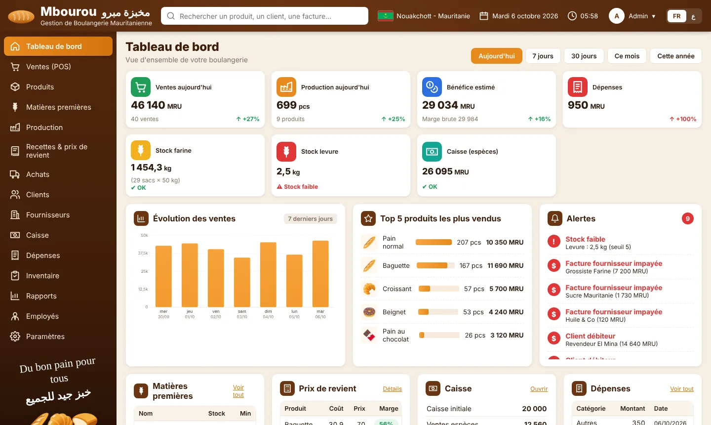
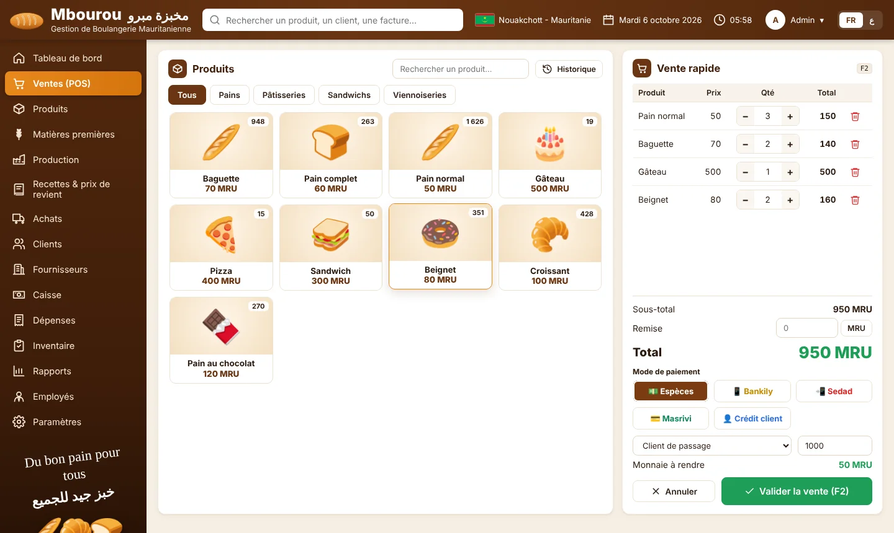
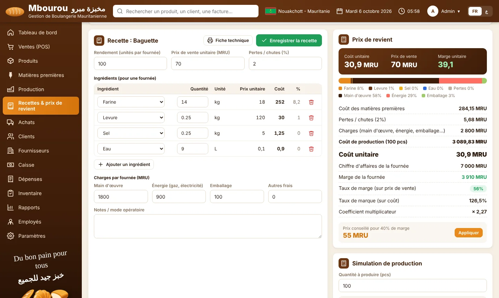

# Mbourou — Gestion de Boulangerie · مخبزة مبرو

Application de gestion de boulangerie **bilingue français / arabe**, **100 % hors ligne**, full stack :

- **Serveur** : Node.js (≥ 22.13) avec la base **SQLite intégrée** (`node:sqlite`) — **aucune dépendance, aucun `npm install`**.
- **Interface** : HTML / CSS / JavaScript sans framework ni CDN (polices et icônes locales) — fonctionne sans internet.
- **Données** : un seul fichier `data/mbourou.db` (facile à sauvegarder sur clé USB).

## Démarrer

1. Installer **Node.js 22.13+** (24 LTS conseillé). Sur un poste sans internet, copiez l'installeur depuis une clé USB.
2. Windows : double-cliquer sur **`Demarrer-Mbourou.bat`**. Linux / macOS : `./demarrer.sh` (ou `node server.js`).
3. Le navigateur s'ouvre sur **http://localhost:3000**.

Comptes par défaut : **admin / admin** (accès complet) — **caisse / 1234** (caissier). Changez-les dans *Paramètres*.

Une 2ᵉ caisse ou une tablette sur le même réseau Wi-Fi local peut se connecter via l'adresse affichée au démarrage (`http://192.168.x.x:3000`), toujours sans internet.

Au premier lancement, la base est remplie avec 30 jours de **données de démonstration** (produits de la maquette, recettes, ventes, achats…). Pour repartir de zéro : *Paramètres → Vider les opérations*.

## Modules

| Module | Ce qu'il fait |
|---|---|
| Tableau de bord | Ventes, production, bénéfice estimé, dépenses, stocks farine/levure, caisse ; évolution 7 jours, top 5, alertes |
| Ventes (POS) | Caisse tactile, remise (MRU ou %), Espèces / Bankily / Sedad / Masrivi / Crédit client, monnaie à rendre, ticket 80 mm bilingue, F2 pour valider, historique et annulation |
| Produits | Catalogue FR/AR, photo ou icône, prix, stock, coût de revient et marge |
| Matières premières | Stocks, seuils d'alerte, **prix moyen pondéré (PMP)** recalculé à chaque achat |
| Production | Fournées : déduction automatique des matières, contrôle de stock, coût réel par fournée |
| **Recettes & prix de revient** | Fiche technique par produit, calcul en direct, simulation, prix conseillé, impression |
| Achats | Réceptions fournisseurs multi-lignes, paiement partiel → dette fournisseur |
| Clients / Fournisseurs | Soldes, plafond de crédit, encaissements / règlements, historique |
| Caisse | Fond initial, ventes espèces, encaissements, dépenses, retraits/apports, caisse théorique vs réelle, clôture |
| Dépenses | Par catégorie, modes de paiement, export CSV |
| Inventaire | Comptage physique, écarts valorisés, pertes / invendus, journal des mouvements |
| Rapports | CA, coût de revient des ventes, marge brute, bénéfice net, rentabilité par produit, consommation, exports CSV, impression |
| Employés | Fiches, masse salariale, paiement des salaires (→ dépenses) |
| Paramètres | Infos boulangerie FR/AR, marge cible, utilisateurs et rôles, sauvegarde / restauration |

## Calcul du prix de revient

Pour chaque recette (une fournée de *N* unités) :

```
Coût matières   = Σ (quantité de l'ingrédient × PMP de la matière)
Pertes          = Coût matières × % de pertes
Charges         = main d'œuvre + énergie (gaz, électricité) + emballage + autres frais
Coût du lot     = Coût matières + Pertes + Charges
Coût unitaire   = Coût du lot ÷ N
Marge unitaire  = Prix de vente − Coût unitaire
Taux de marge   = Marge unitaire ÷ Prix de vente
Coefficient     = Prix de vente ÷ Coût unitaire
Prix conseillé  = Coût unitaire ÷ (1 − marge cible), arrondi aux 5 MRU supérieurs
```

- Le **PMP** d'une matière est mis à jour à chaque achat : `(stock × ancien PMP + quantité × prix d'achat) ÷ (stock + quantité)`. Le coût de revient de tous les produits est alors recalculé automatiquement.
- Chaque **production** enregistre son coût réel (matières consommées au PMP du moment + charges au prorata), et chaque **vente** mémorise le coût de revient des articles : les rapports donnent donc la marge réelle, produit par produit.

## Sauvegardes

*Paramètres → Télécharger une sauvegarde* produit un fichier `.db` complet. *Restaurer* le remplace (une copie de sécurité est d'abord créée dans `data/`). Vous pouvez aussi simplement copier `data/mbourou.db` application arrêtée.

## Configuration avancée

Variables d'environnement : `PORT` (défaut 3000), `HOST` (défaut `0.0.0.0` ; mettre `127.0.0.1` pour interdire l'accès réseau local).

## Aperçu



| Point de vente | Prix de revient |
|---|---|
|  |  |

Vidéos guide d'une minute (voix off, sous-titres) : [français](docs/videos/mbourou-fr.mp4) · [arabe](docs/videos/mbourou-ar.mp4)

---
Édité par **IT-RIM** — Nouakchott, Mauritanie · [it-rim.net](https://www.it-rim.net) · WhatsApp +222 43 45 92 22
